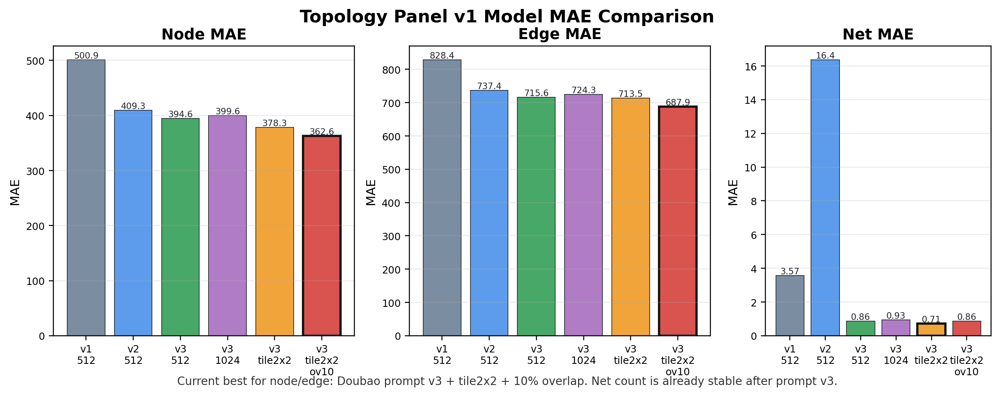
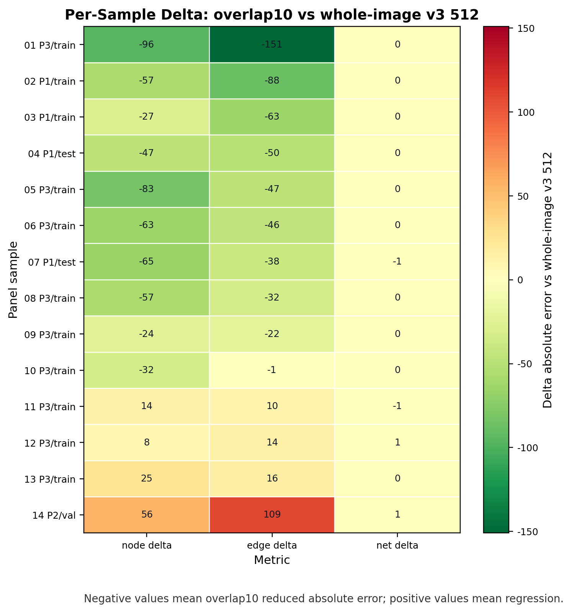
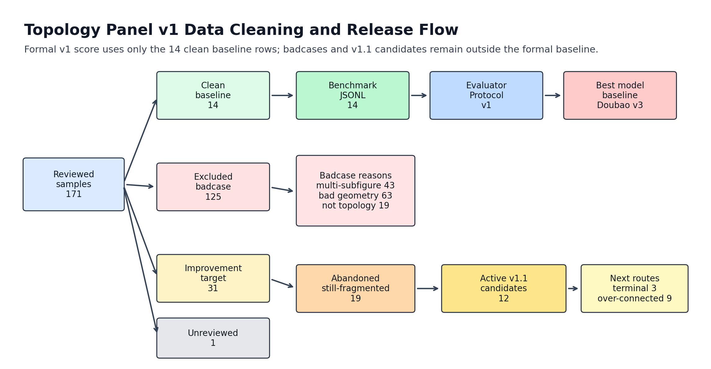

# Topology Panel v1 图表索引

日期：2026-07-10

本页汇总当前答辩和阶段报告可直接使用的图表。图中主要标签使用英文，以保证跨平台字体渲染稳定。

## 1. MAE 柱状图

- 对比 Doubao v1/v2/v3、1024 整图、tile2x2、tile2x2 overlap10。
- 当前最佳 node/edge MAE：`doubao_prompt_v3_tile2x2_overlap10`。

## 2. Per-Sample Delta 热力图

- 数值含义：`overlap10 absolute error - whole-image v3 512 absolute error`。
- 负数代表 overlap10 改善，正数代表退化。
- 样本标签映射：`docs/figures/topology_panel_v1_per_sample_delta_heatmap_labels.csv`。

## 3. 数据清洗流转图

- 展示 reviewed samples 到 clean baseline、excluded badcase、improvement target、benchmark JSONL 与 best model baseline 的关系。
- 强调正式 v1 score 只使用 14 条 clean baseline。

## 文件清单

- `docs/figures/topology_panel_v1_mae_bar_chart.png`
- `docs/figures/topology_panel_v1_mae_bar_chart.svg`
- `docs/figures/topology_panel_v1_per_sample_delta_heatmap.png`
- `docs/figures/topology_panel_v1_per_sample_delta_heatmap.svg`
- `docs/figures/topology_panel_v1_data_cleaning_flow.png`
- `docs/figures/topology_panel_v1_data_cleaning_flow.svg`
- `docs/figures/topology_panel_v1_per_sample_delta_heatmap_labels.csv`
